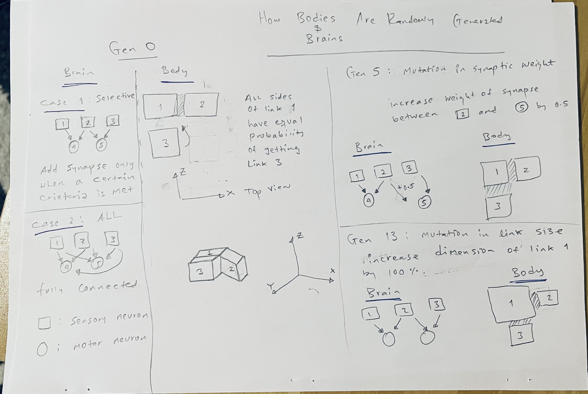
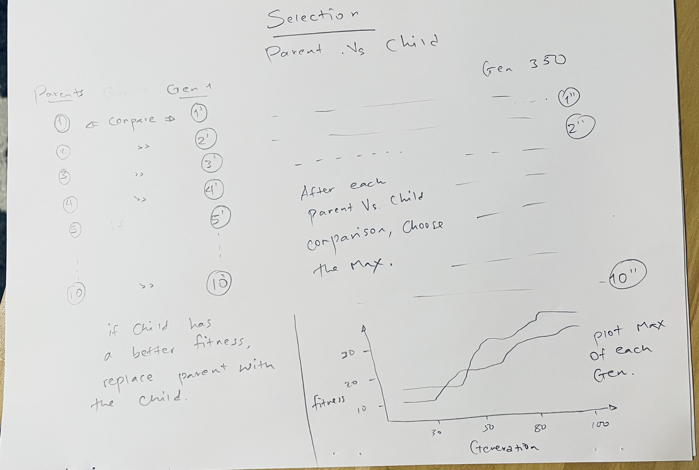

______________________________  
###############################################################################\
###############################################################################\
#####################   CS_396: Artifical Life              \
#####################   Final Project By: Abenezer Tamene   \
#####################   THE SCIENCE OPTION                 \
###############################################################################\
###############################################################################
_____________________________

# How to start the creature:

    Run the search.py file.

# How it works

Running the program generates a creature with a random shape that is evolved to traval fartherest from its initial position. The fitness function favors creatures that travel farther. To achive this, synapse weights of the creature's brain neuron are mutated.

The follwing video gives a brief overview of the two hypotheses I tested, the experimental set-up used, and the results observed. [link](https://youtu.be/ItzhqBzQRFU) 

The following B-Roll clip shows some of the good and bad creatures observed. [link](https://youtu.be/NXqqCg-zxzo)

> Shown below is a teaser gif

# Body and Brain Generation

## Body generation

To create the body, a random number of links is chosen. Then joints will be generated --> num_of_joints <= num_of_links - 1. The links will have a random width, length, and height. Then based on a coin flip, a few links are chosen to have a sensor. The probability is fair. Following that links and joints are connected together. A given link has equal chance of binding to one of the 6 sides of an existing or parent link. Details are attached below. Since links are attached in all the 3 directions with equal probability (+x, -x, +y, -y, +z, -z), infinitely many shapes are possible.  

> The randomly generated dimensions (which are between 0 and 1), will be changed when testing hypothesis 2.

## Brain generation

For the brain, links that were assigned to have a sensors will be attached with a sensory neuron. Motors are added to all joints, however. Then a synapse connection is made between sensory neurons and motor neurons. How Brain generation occurs is shown in the diagram above.
> All sensory neurons will be connected to all motor neurons EXCEPT when testing hypothesis 1.

# Mutation

The mutation chages synapse weight  of neurons connection. If the connection results in a better fitness for a creature, the new connection will be chosen instead of the 'parent/previous' conection. When mutating, a random synapse weight is chosen and changed. How mutation occurs is shown in the diagram above. The selection diagram below shows how a creature is selected if it happens to get a higher fitness than its parent. 

# Selection

For the best creature selection, I used the algorithm described in parallelHillClimber.py. This works by first instantiating parent creatures. Then based on the number of generations set, each parent spawns a child with a different synapse weight. Mutation causes change in synapse weight. Then the fitness of each mutated child is compared with its parent and if it's greater, the parent will be replaced with the child. Finally, fitness value of the best creature at each generation is gathered and plotted.

# Hypotheses

For this project, I attempted to test two hypotheses in order to see how the Robot will behave given different physical conditions.

> Hypothesis 1: Creatures with stronger neural pathway (more neuron connection) will move further. 

Creatures with stronger synapse weight connection between  sensory neurons, hidden neurons, and motor neurons would move farther as they will be able to make quick and reactive movements given an environmental stimulai. I predict this to be true because of the 'information feeding' nature of neurons. The stronger the connection between things is, the more easier it is for information to flow between them. Thus, the presense of a stronger synapse weight between neurons could lead to a more efficient motor neuron response which, in turn, would result in efficient locomotion. 

>Hypothesis 2: Creatures with a smaller body part, aka links, will move farther than creatures with larger body parts. 

I predict this would be true as we often see in nature that living things with a larger limb/joints like Elephants or Giraffes cover less distance in comparison to creatures with smaller body parts like Zebras, Foxes, or Lions given the same number of body parts and time. I assume this has to do with the fact that often larger body parts limit movement due to their weight. In addition, larger body parts sometimes reduce flexibility, thus creatures with larger body parts won't be able to make sudden movements or be quick to react to incidents like creatures with smaller body parts.

# Methods

I wanted to test two hypothesis.  The measuring criteria was how far creatures moved from their initial position. For each hypothesis, I run 32,500 simulation totalling 65,000 simulations. In each hypothesis test, I run the simulation twice to see if their would be inconsistencies or changes due to random nature of size and shape generation. 

For Run 1, I run the simulation for 5 random seeds each with a population size of 5 and generation count of 250 for both SELECTIVE and ALL synapse connection types totalling 12,500 simulation (2 types * 5 seeds * 5 population size * 250 generations = 12,500 sims)

>**SELECTIVE: not all neurons are connected to each other.\
**ALL: neurons are fully connected to each other. 

For Run 2, I kept everything the same except for population size; I increased it to 8 resulting in 20,000 simulations (2 types * 5 seeds * 8 population size * 250 generations = 20,000 sims)

> I performed each of these two Runs for both Hypothesis 1 and 2. For my computer, 2500 simulations took around 14 minutes. 

> Code specific to each of these two hypothese is found mainly in solution.py file, specifically Create_Body and Create_Brain functions. The call happens from search.py

# Results and Discussion

## Result for Hypothesis 1: Neuron connection vs locomotion

> Fitness max, mean, and standard deviation for test on hypothesis 1. 

> Fitness graph for **Run 1**: simulation with a population size of 5

> Fitness graph for **Run 2**: simulation with a population size of 8

### **Discussion** 

The average fitness and the max fitness for creatures with more synapse connection between neurons was higher than creatues with less neuron synapse connection. This was inline with what I expected. In both Run 1 and Run 2, robots were able to move further when the number of neural connection in their brain was higher. The increase in the number of population for Run 2 resulted in a higher fitness which is expecpted since higher population size allows for various kinds of creatures which will, in turn, results in more diverse set of fitnesses. 

One interesting thing to note in both Run 1 and Run 2 is variation in standard deviation of fitness values. In both Runs, creatures with fully connected neural pathway showed a higher standard deviation. This implies that when there is a higher connection between neurons of a creatures, there is a good chance that a creature with a really high fitness value would appear at some point in the evolution; this will result in a higer deviation from the mean.

Lastly, I noted that in comparison to Run 1, creatures in Run 2 evolve more which makes sense as Run 2 has a higher population size per generaiton. It can be seen in the two fitness graphs above that Run 2 evolves more (fitness values keep increasing going upto 70) in comparison to Run 1 that doesn't evolve as much (max is capped around 60).

## Result for Hypothesis 2: 

> Fitness max, mean, and standard deviation for test on hypothesis 2. 

> Fitness graph for **Run 1**: simulation with a population size of 5

> Fitness graph for **Run 2**: simulation with a population size of 8

### **Discussion**

>Size in this test refers to a sclar that multiplies randomly generated link dimension values which are between 0 and 1. 

For Run 1 with a population size of 5, the average fitness of creatures with size 4 was higher than creatures with a size of 0.5. This is contrary to what I expected. I expected creatures with smaller body parts would travel farther but according to the simulation, the opposite is true. One reason for this would be the lunges/steps that larger creatures take is higher than those will smaller steps. 

For Run 2 with a population size of 8, a similar pattern was seen like Run 1 in terms of mean fitness value: creatures with larger size travelled farther by a significant margin. Again this confirms that creatures with a larger size could take advanrage of their bigger body parts to make bigger strides. 

>**Randomness and Uncertainity**
The maximum fitness value, is larger for creatures with a size of 0.5. I believe this could be due to the random nature of size and body shape generation as it's not seen for Run 2. I could not make a significant generalization about the standard deviation for each of the two Runs. Standard deviation was higher in Run 1 and maximum value was higher in Run 2.

Regarding the graph, I noticed the result was a bit different from what I found out for hypothesis 1. In hypothesis 2, the graph shows more evolution (consistent increases) for Run 1 (the one with 5 population size) in comparison to Run 2 (the one with 8 population size). In fact, in one of the seeds for Run 2 (shown in black in the figure above), the fitness value remains constant throught the 250 generations. One of the reasons for this could be the possibilitiy that the highest fitness value was achieved early on in evolution due to randomness/luck and the generations that came after it have a lower or equal fitness value.

In all Runs, evolution seems to slow down after 150-200 generations. Like mentioned before, one reason could be the possibility of achieving high fitness value early on in the evolution. Another reason could be lack of diverse population size. Even though all Runs were done with at least 250 generations, limited population size could still end up being an issue. Lastly, the kind of fitness function and what it's measuring could be another contributing factor. 

# Limitations and Future Work

The biggest source of uncertainity in my experiment was limitation of computing resource. I am running these simulations in a computer with 8GB RAM and 1.8GHz speed. This significantly affected how many simulations I could have done. Even though I did a total of 65,000 simulations, running these simulations in a bigger and more efficient servers would have allowed me to see more interesting behaviors and patterns of locomotion. 

For this project I focused on locomotion aspect of creaures. Even though locomotion is important, there are wide variety of behaviors a creature can exhibit to survive like vision, sound detection, weight of the creature, types of joints between links, shape of body parts, etc. The environment could also be changed like the gravity, frictional value of the ground, etc. Investigating these behaviros would allow us to simulate how living things would have been affected in early stages of life. 

# Final touch

I run the simulation again for each hypothesis once again for a simulation of 56,000. \
4 total tests (2 hypotheses each with control and experimental group). \
Each of these 4 tests were done with 5 seeds, a population size of 8 and a generation limit of 350.\
4*5*8*350 = 56,000

>This brings the total simulation I've done to over 100,000. The analysis files (the text files starting with "hypo_test_") contain mean, max, and std dev for this run.

# Reference

This work takes inspiration from [ludobots](www.reddit.com/r/ludobots) subreddit. I also extensively used Pyrosim library.

